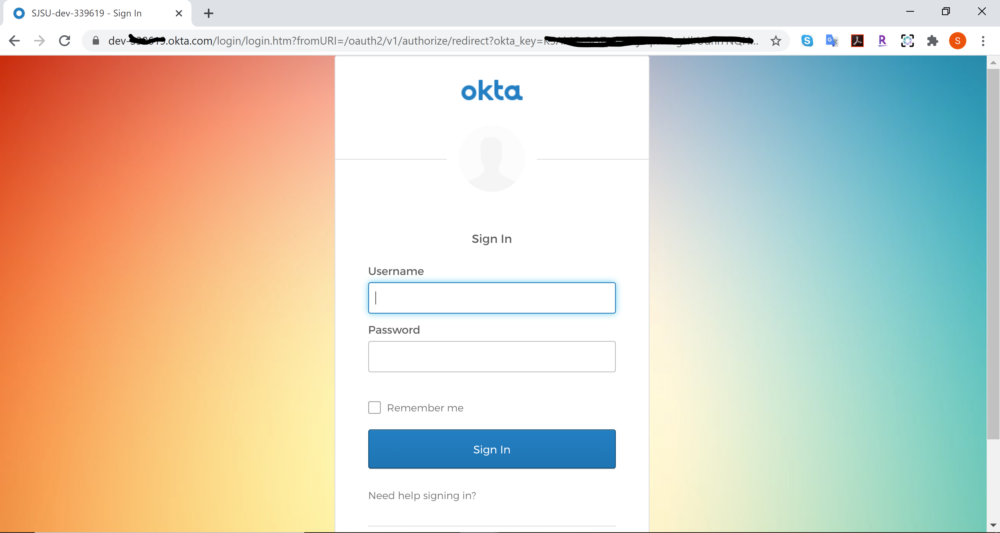

# cmpe281-project1
## Project 1 - Whippystore
### Course: Cloud Technologies
### Professor: Sanjay Garje
### Student: Shreya Ghotankar

#### Architecture Diagram

#### UI Screenshots

#### Local setup:

* Eclipse/IntelliJ IDE
* Okta developer account
* You can configure an User Pool in Cognito(optional)
* You have an AWS account
* You need to create an AWS account to setup the AWS resources used in this project.
* S3 – Go to S3 console in AWS, click on create bucket, provide a unique name (name has to be globally unique). Select the region you want your bucket to be in, enable versioning and click on create bucket. Now go to your bucket in S3 and under management tab you can create lifecycle policy and replication rules.
* For download to work with CloudFront Distribution, you need to generate OAI in CloudFront Service and add it to your S3 bucket policy.
* Create RDS MySQL instance, connect using MySQL Workbench and create the table using the DDL from table.sql file.

1.	Clone the github repository.
2.	Add AWS properties associated with S3, RDS, CloudFront to application.yml file.
3.	Add the client ID and secret for Okta.
4.	Application will run on localhost:5000

